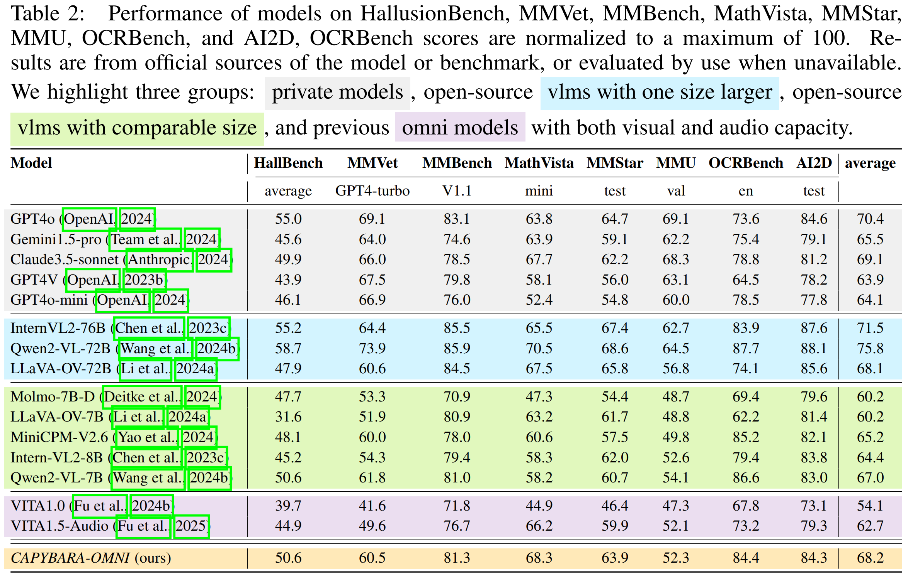
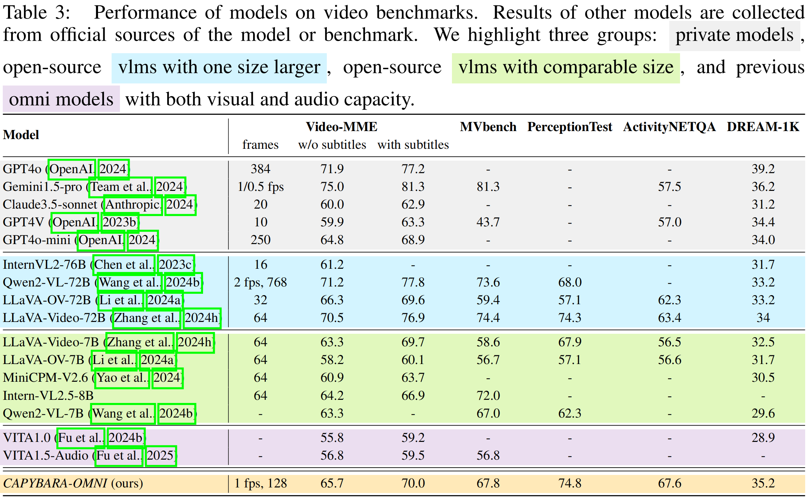
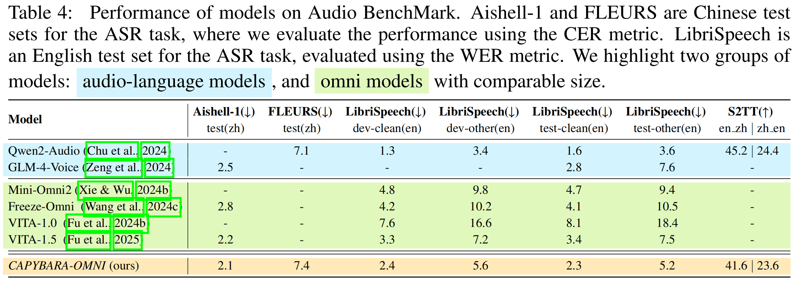

<!-- 1. Lightweight training data and strategies for full modalities understanding. <!-- 轻量级的全模态训练数据及训练策略；
2. Outstanding audio, image and video understanding performance belowing 10B;
3. We show the method to build application via a Omini-Chat model; -->

## Video Performance
<video width="800" height="500" controls>
  <source src="resources/mmexport1755850457417.mp4" type="video/mp4">
  Your browser does not support the video tag.
</video>

# CAPYBARA-OMNI Overview
<!-- xxx, features:
1. Lightweight training data and strategies designed for comprehensive multimodal understanding.
2. Outstanding performance in audio, image and video understanding, achieved with models under 10B parameters.
3. We demonstrates a practical approach for building applications via the development of Omini-Chat model. 
1. Lightweight multimodal understanding training data and training strategies, achieving minimal performance loss after modality fusion.
2. Comprehensive evaluation of the Omni model's performance in audio, image, and video understanding, demonstrating that our model significantly outperforms existing Omni models in all aspects and achieves a leading position compared to specialized models of the same scale.
3. Through the training of the Omni-Chat model, we showcase the method for application development based on CAPYBARA-Omni.-->

1. We show a detailed roadmap to endow a LLM with competitive visual and audio understanding capabilities through lightweight training while addressing the issue of mutual interference among modal understanding capabilities.
2. We develop Capybara-OMNI, which is a model that can handle text, image, video, and audio input, based on our proposed lightweight training process, demonstrating strong understanding capabilities across all modalities. In an effort to help subsequent researchers easily replicate our results, we have made the training data for audio alignment publicly available.
3. We propose an efficient method for enhancing the instruction-following and interaction capabilities. With meticulously constructed multimodal instruction fine-tuning data, the fine-tuned Capybara-OMNI show strong human-computer interaction capabilities and the ability to understand complex multimodal scenarios.

# Experimental Results

## Image performance

## Video performance

## Audio performance

